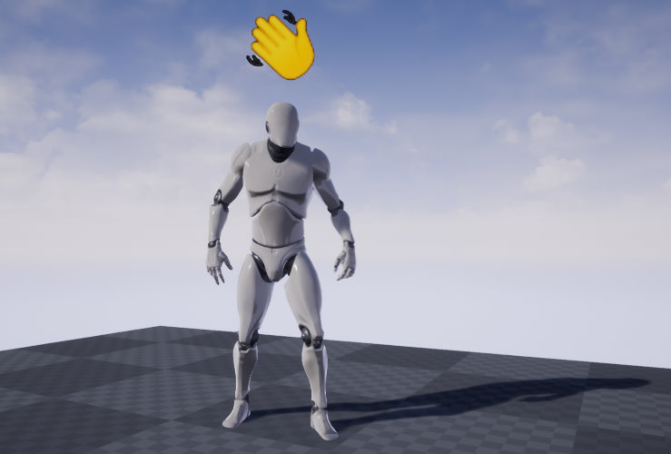
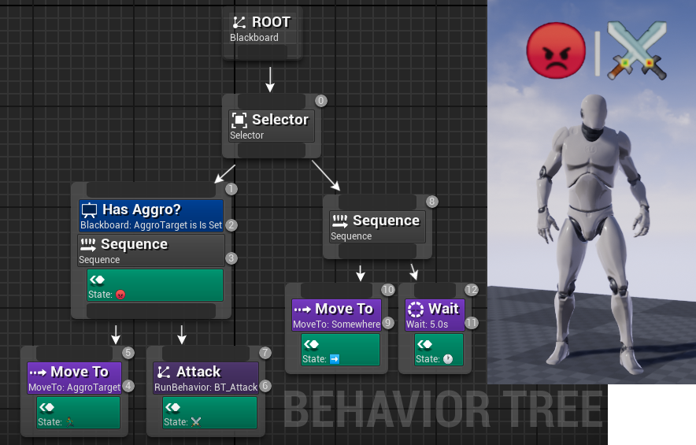
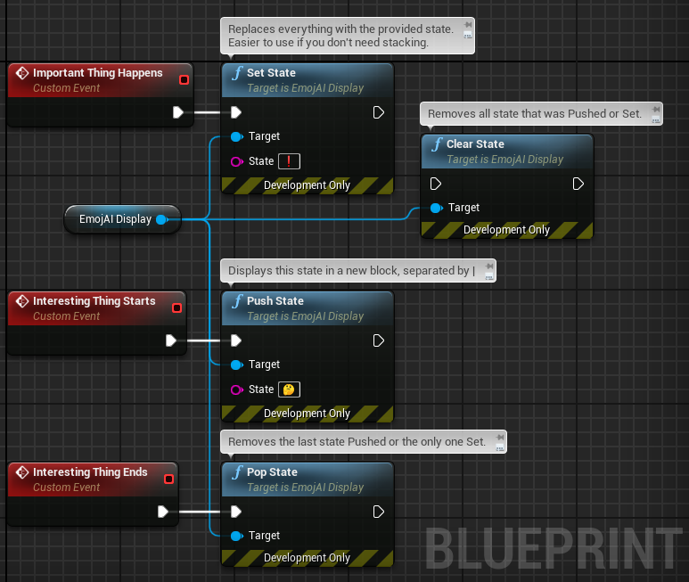

# EmojAI

Born from a silly idea over at [Unreal Slackers](https://unrealslackers.org),
this plugin implements a widget component for Unreal Engine that lets you
display Behavior Tree states as emoji above your AI pawns:

Just mark the BT nodes that you're interested in with the
`EmojAI Display State` service and add the `EmojAI Display` component to
your pawn:

For everything else, the component comes with a C++ and Blueprint API:

The plugin works with arbitrary strings of course, but where's the fun in that?
Emoji characters turned out to be more useful than you'd initially think,
they're very compact.
